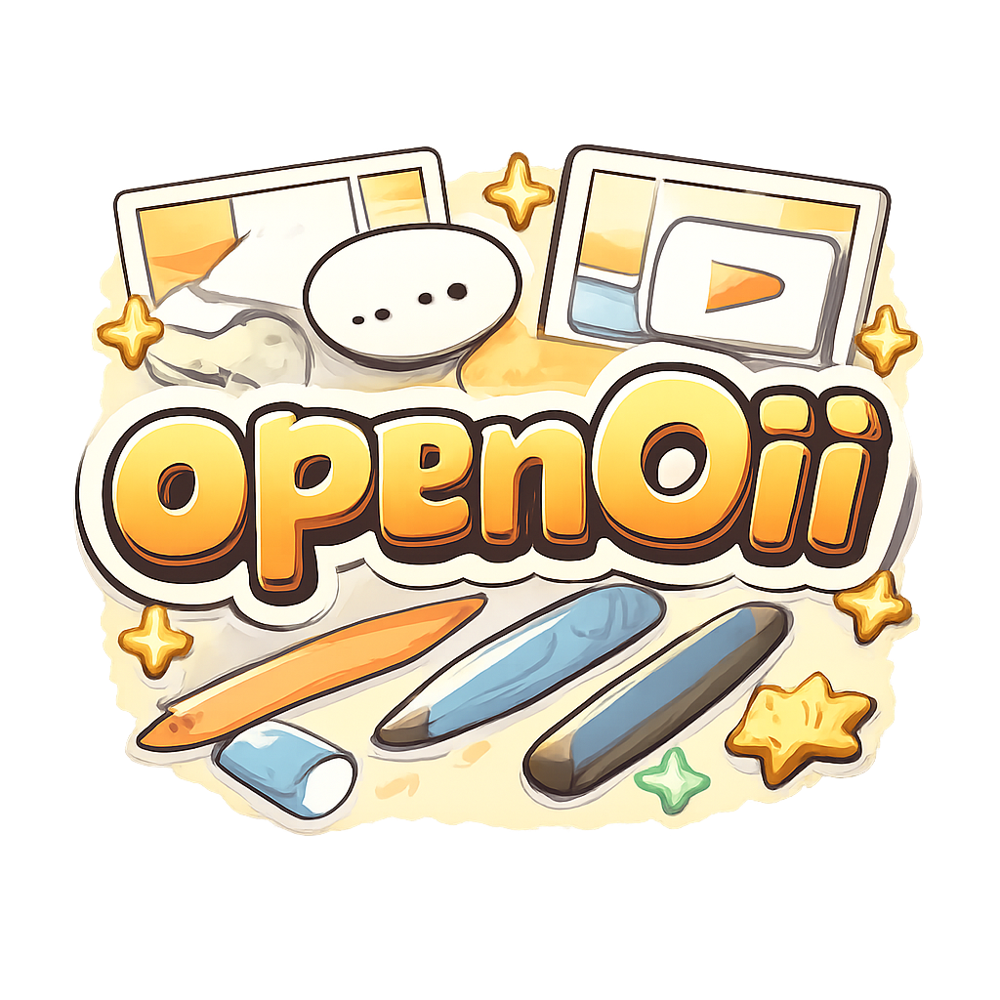
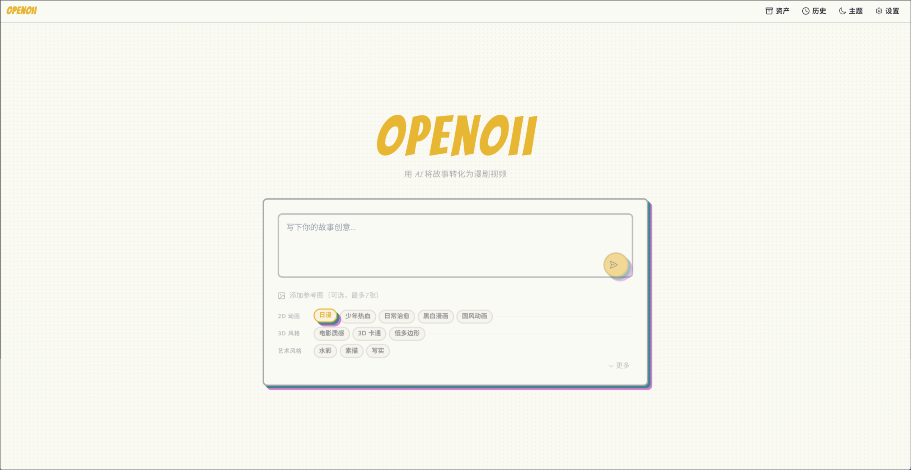
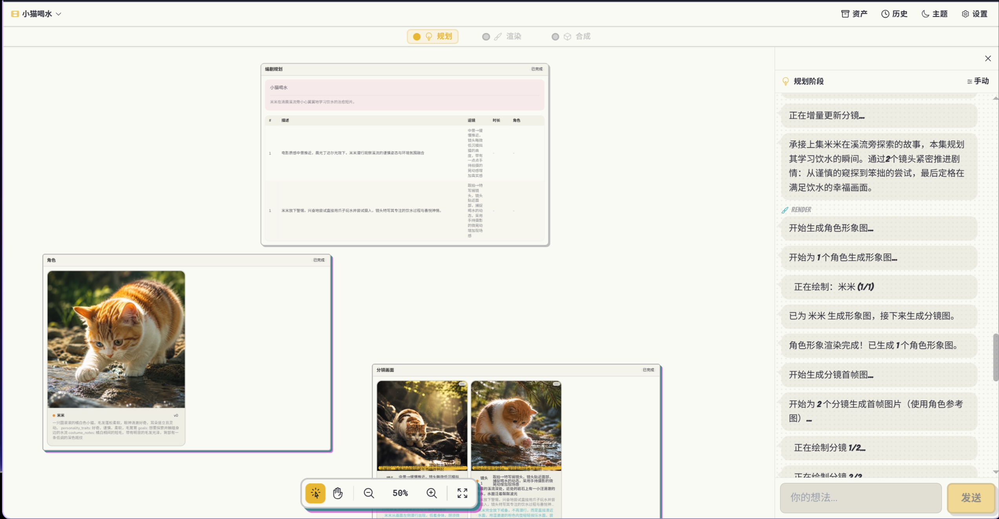
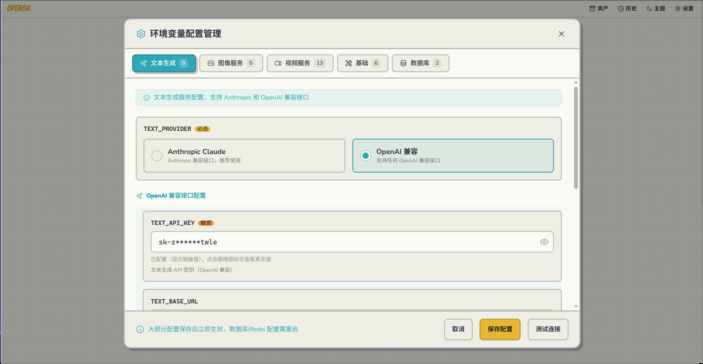

<div align="center">
  

**故事想法 → 多智能体协作 → 漫剧成片**

</div>

openOii 是一个 **LangGraph 学习项目**：把故事创意串成规划、角色/分镜生成、视频生成与合成的完整链路，并用无限画布展示过程与结果。

> [!WARNING]
> 这是一个 **学习 / 演示项目**，重点是验证 LangGraph 编排、多阶段生成、恢复执行与前后端协作。
> **不适合直接用于工业生产环境**。

## 你能看到什么

- 多阶段 AI 生成链路
- WebSocket 实时进度
- 可恢复 / 可取消 / 可反馈的 run 流程
- tldraw 无限画布审阅角色、分镜与结果
- 前端环境变量配置面板

## 界面预览

### 首页



### 画布与生成流程



### 配置面板



## 技术栈

- Frontend: React 18 + TypeScript + tldraw
- Backend: FastAPI + SQLModel + LangGraph
- Infra: PostgreSQL + Redis + `/static`

## 快速开始

```bash
cp backend/.env.example backend/.env
docker-compose up -d
```

- Frontend: http://localhost:15173
- API Docs: http://localhost:18765/docs

本地开发：

```bash
# backend
cd backend
uv sync
uv run uvicorn app.main:app --reload --host 0.0.0.0 --port 18765

# frontend
cd frontend
pnpm install
pnpm dev
```

## 常用命令

```bash
# backend
cd backend
uv run pytest
uv run ruff check app tests

# frontend
cd frontend
pnpm test
pnpm build
```

## License

MIT
